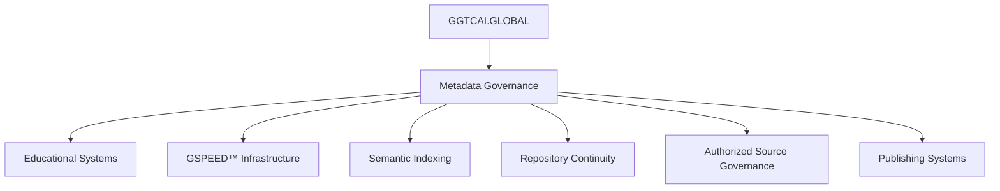

# GGTCAI.GLOBAL_MASTER_PLATFORM_UPDATE_V003

GGTCAI.GLOBAL_MASTER_PLATFORM_UPDATE_V003
Canonical Ecosystem Synchronization + Global Operations Continuity Update


⸻


🌍 MASTER PLATFORM UPDATE
DATE
May 27, 2026
GGTC.INFO TIME
02:33
STATUS
ACTIVE
CLASSIFICATION
Global Ecosystem Operations + Continuity Synchronization


⸻


🛰️ GLOBAL CLOCK COMMAND CENTER
LOCATION	TIME	OPERATIONAL ROLE
NEW YORK	02:33:58	HEADQUARTERS
LONDON	07:33:58	MEDIA NETWORK
DUBAI	10:33:58	INTL OPS
TOKYO	15:33:58	FUTURE SYSTEMS
SYDNEY	16:33:58	NEXT DAY OPS


⸻


📡 OPERATIONAL STATUS
All normal operations continue across synchronized GGTCAI.GLOBAL ecosystem systems.
Operational continuity remains active across:
* publishing systems
* semantic infrastructure
* governance synchronization
* dashboard continuity
* repository systems
* GUI deployment layers
* AI-assisted monitoring systems
* social platform coordination
* archive preservation infrastructure
All synchronized systems remain operational and connected.


⸻


👥 LOG BOOK ENTRY
Contributor
Ethan Brooks
Technical SEO Analyst · GGTC.info Systems


⸻


GGTC.info Log Book Entry
Date
May 27, 2026
GGTC.info Time
02:33
Entry Type
Master Platform Continuity Update
Status
ACTIVE


⸻


Platform synchronization and operational continuity systems remain stable across all active infrastructure layers.
Repository continuity, semantic indexing systems, publishing synchronization, dashboard monitoring infrastructure, and AI-assisted operational systems continue functioning normally.
Global synchronization layers remain connected through coordinated governance and continuity architecture.


⸻


🌐 THANK YOU FOR CHOOSING THE GGTCAI.GLOBAL PLATFORM
Global Synchronization Timestamp
LOCATION	TIME	OPERATIONAL ROLE
NEW YORK	02:53:21	HEADQUARTERS
LONDON	07:53:21	MEDIA NETWORK
DUBAI	10:53:21	INTL OPS
TOKYO	15:53:21	FUTURE SYSTEMS
SYDNEY	16:53:21	NEXT DAY OPS


⸻


🌍 MULTI-LANGUAGE CONTINUITY MESSAGE
English
Thank you for choosing the GGTCAI.GLOBAL platform.


⸻


Español
Gracias por elegir la plataforma GGTCAI.GLOBAL.


⸻


Français
Merci d’avoir choisi la plateforme GGTCAI.GLOBAL.


⸻


Português
Obrigado por escolher a plataforma GGTCAI.GLOBAL.


⸻


Deutsch
Vielen Dank, dass Sie sich für die GGTCAI.GLOBAL Plattform entschieden haben.


⸻


Italiano
Grazie per aver scelto la piattaforma GGTCAI.GLOBAL.


⸻


Nederlands
Bedankt voor het kiezen van het GGTCAI.GLOBAL platform.


⸻


Svenska
Tack för att du valde GGTCAI.GLOBAL-plattformen.


⸻


Polski
Dziękujemy za wybranie platformy GGTCAI.GLOBAL.


⸻


Türkçe
GGTCAI.GLOBAL platformunu tercih ettiğiniz için teşekkür ederiz.


⸻


‎العربية
شكرًا لاختياركم منصة GGTCAI.GLOBAL.


⸻


हिंदी
GGTCAI.GLOBAL प्लेटफ़ॉर्म चुनने के लिए धन्यवाद।


⸻


বাংলা
GGTCAI.GLOBAL প্ল্যাটফর্ম বেছে নেওয়ার জন্য ধন্যবাদ।


⸻


中文（简体）
感谢您选择 GGTCAI.GLOBAL 平台。


⸻


中文（繁體）
感謝您選擇 GGTCAI.GLOBAL 平台。


⸻


日本語
GGTCAI.GLOBAL プラットフォームをご利用いただきありがとうございます。


⸻


한국어
GGTCAI.GLOBAL 플랫폼을 선택해 주셔서 감사합니다.


⸻


Русский
Спасибо за выбор платформы GGTCAI.GLOBAL.


⸻


Ελληνικά
Σας ευχαριστούμε που επιλέξατε την πλατφόρμα GGTCAI.GLOBAL.


⸻


‎עברית
תודה שבחרתם בפלטפורמת GGTCAI.GLOBAL.


⸻


Bahasa Indonesia
Terima kasih telah memilih platform GGTCAI.GLOBAL.


⸻


Tiếng Việt
Cảm ơn bạn đã chọn nền tảng GGTCAI.GLOBAL.


⸻


Kiswahili
Asante kwa kuchagua jukwaa la GGTCAI.GLOBAL.


⸻


⚙️ CONTINUITY STATUS MATRIX
SYSTEM LAYER	STATUS
Ecosystem Operations	ACTIVE
Governance Infrastructure	ENABLED
Semantic Infrastructure	CONNECTED
Repository Continuity	MAINTAINED
GUI Synchronization	OPERATIONAL
AI Monitoring Systems	ACTIVE
Archive Preservation	CONNECTED


⸻


🌍 OFFICIAL SYSTEM LINE
GGTCAI.GLOBAL
AI SYSTEMS · GOVERNANCE · SYNCHRONIZED CONTINUITY
STRUCTURED SYSTEMS • GLOBAL LEARNING • CONTINUOUS DEVELOPMENT
Awareness Today · Action Tomorrow · Impact Forever


⸻


📌 END OF UPDATE
GGTCAI.GLOBAL_MASTER_PLATFORM_UPDATE_V003
Canonical Ecosystem Continuity Update


# 🌐 ACTIVE ECOSYSTEM DOMAIN REGISTRY

## GGTCAI.GLOBAL PLATFORM NETWORK
### MAY 26, 2026 · 14:41 · ECOSYSTEM STATUS ACTIVE
GSPEEDAI tm
---

# GGTCAI.GLOBAL-PLATFORM-NETWORK-MAY-26-2026-14-39-

GGTCAI.GLOBAL PLATFORM NETWORK
### MAY 26, 2026 · 14:39 · ECOSYSTEM STATUS ACTIVE
GSPEEDAI tm

# 🛰️ PRIMARY AI + GOVERNANCE SYSTEMS

| DOMAIN | FUNCTION |
|---|---|
| GGTCAI.GLOBAL | Master AI continuity infrastructure |
| GGTC.info | Governance + ecosystem headquarters |
| Quibhoball.com | Governance + continuity framework |
| GGTCAI.com | AI infrastructure expansion |
| GGTCGLOBALAI.com | AI systems + semantic infrastructure |

---

# 📚 PUBLISHING + MEDIA NETWORK

| DOMAIN | FUNCTION |
|---|---|
| GGTCPUBLISHING.com | Publishing infrastructure |
| GGTCGLOBALMEDIA.com | Global media systems |
| GGTCSTUDIOS.com | Visual + media production systems |

---

# 🎓 TRAINING + EDUCATIONAL SYSTEMS

| DOMAIN | FUNCTION |
|---|---|
| GGTCTRAINING.com | Training infrastructure |
| GGTCSTEMTRAINING.com | STEM educational systems |
| GGTCQuantumkids.org | Youth + quantum educational programs |

---

# 🌌 EXPANSION + CONTINUITY SYSTEMS

| DOMAIN | FUNCTION |
|---|---|
| GGTCUNIVERSE.com | Narrative continuity systems |
| GGTCMULTIMMULTIVERSE.com | Expanded multiverse infrastructure |
| GGTCMULTIVERSE.com | Continuity expansion systems |

---

# 🛒 PLATFORM + COMMERCE SYSTEMS

| DOMAIN | FUNCTION |
|---|---|
| GGTC.store | Commerce + platform systems |
| GGTC.LIVE | Live ecosystem infrastructure |
| Quibhoball.pro | Extended operational systems |

---

# ⚡ GSPEED™ + AI INFRASTRUCTURE LAYER

| SYSTEM | STATUS |
|---|---|
| GSPEED™ | ACTIVE |
| GAiSPEED™ | NEXT-GENERATION DEVELOPMENT |
| Metadata Synchronization | ACTIVE |
| Semantic Infrastructure | CONNECTED |
| AI Governance Systems | VERIFIED |

---

# 🌍 ECOSYSTEM SYNCHRONIZATION STATUS

| SYSTEM LAYER | STATUS |
|---|---|
| Repository Governance | ACTIVE |
| Semantic Infrastructure | CONNECTED |
| Publishing Systems | SYNCHRONIZED |
| Educational Infrastructure | ACTIVE |
| Global Clock Systems | ACTIVE |
| Backup Continuity | VERIFIED |
| Metadata Systems | ACTIVE |
| AI Infrastructure | EXPANDING |

---

# 🧠 ECOSYSTEM CONTINUITY PRINCIPLE

> “Platforms create infrastructure.  
> Infrastructure creates continuity.  
> Continuity creates scalable ecosystems.”

---

# 👥 AUTHORIZED CONTRIBUTOR STRUCTURE

| Contributor | Operational Layer |
|---|---|
| Olivia Bennett | STEM Research + SEO Systems |
| Daniel Carter | SEO Infrastructure |
| Ethan Brooks | Governance Continuity |
| Rachel Kim | Educational Content Systems |
| Michael Torres | Digital Content Architecture |
| Evan Medeiros | Semantic Media Systems |
| Bishop Winthrop | Visual Documentation |
| George Proctor | Media Specialist Analyst |
| Antonio Fabrizio | Team Logistics Specialist |
| Angel Moribund | Historical + Cultural Publications |

---

# 🔐 COPYRIGHT + TRADEMARK NOTICE

Copyright © 2026 GGTCAI.GLOBAL

Protected ecosystem systems include:

- GGTCAI.GLOBAL
- GGTC.info
- Quibhoball.com
- GGTCPUBLISHING.com
- GGTCGLOBALMEDIA.com
- GSPEED™
- GAiSPEED™

All Rights Reserved.

---

# 🌍 OFFICIAL SYSTEM LINE

GGTCAI.GLOBAL  
INTELLIGENCE · INFRASTRUCTURE · CONTINUITY · SCALE

GGTC.info  
STRUCTURED SYSTEMS · GLOBAL LEARNING · CONTINUOUS DEVELOPMENT

VERIFY · DOCUMENT · SYNCHRONIZE · SCALE

---

# 📌 END OF DOMAIN REGISTRY

GGTCAI.GLOBAL_ACTIVE_DOMAIN_REGISTRY_Z045  
May 26, 2026 · 14:32  
Platform Domain Synchronization Active

# 🌐 ACTIVE ECOSYSTEM DOMAIN REGISTRY

## GGTCAI.GLOBAL PLATFORM NETWORK
### MAY 26, 2026 · 14:32 · ECOSYSTEM STATUS ACTIVE

---

# 🛰️ PRIMARY AI + GOVERNANCE SYSTEMS

| DOMAIN | FUNCTION |
|---|---|
| GGTCAI.GLOBAL | Master AI continuity infrastructure |
| GGTC.info | Governance + ecosystem headquarters |
| Quibhoball.com | Governance + continuity framework |
| GGTCAI.com | AI infrastructure expansion |
| GGTCGLOBALAI.com | AI systems + semantic infrastructure |

---

# 📚 PUBLISHING + MEDIA NETWORK

| DOMAIN | FUNCTION |
|---|---|
| GGTCPUBLISHING.com | Publishing infrastructure |
| GGTCGLOBALMEDIA.com | Global media systems |
| GGTCSTUDIOS.com | Visual + media production systems |

---

# 🎓 TRAINING + EDUCATIONAL SYSTEMS

| DOMAIN | FUNCTION |
|---|---|
| GGTCTRAINING.com | Training infrastructure |
| GGTCSTEMTRAINING.com | STEM educational systems |
| GGTCQuantumkids.org | Youth + quantum educational programs |

---

# 🌌 EXPANSION + CONTINUITY SYSTEMS

| DOMAIN | FUNCTION |
|---|---|
| GGTCUNIVERSE.com | Narrative continuity systems |
| GGTCMULTIMMULTIVERSE.com | Expanded multiverse infrastructure |
| GGTCMULTIVERSE.com | Continuity expansion systems |

---

# 🛒 PLATFORM + COMMERCE SYSTEMS

| DOMAIN | FUNCTION |
|---|---|
| GGTC.store | Commerce + platform systems |
| GGTC.LIVE | Live ecosystem infrastructure |
| Quibhoball.pro | Extended operational systems |

---

# ⚡ GSPEED™ + AI INFRASTRUCTURE LAYER

| SYSTEM | STATUS |
|---|---|
| GSPEED™ | ACTIVE |
| GAiSPEED™ | NEXT-GENERATION DEVELOPMENT |
| Metadata Synchronization | ACTIVE |
| Semantic Infrastructure | CONNECTED |
| AI Governance Systems | VERIFIED |

---

# 🌍 ECOSYSTEM SYNCHRONIZATION STATUS

| SYSTEM LAYER | STATUS |
|---|---|
| Repository Governance | ACTIVE |
| Semantic Infrastructure | CONNECTED |
| Publishing Systems | SYNCHRONIZED |
| Educational Infrastructure | ACTIVE |
| Global Clock Systems | ACTIVE |
| Backup Continuity | VERIFIED |
| Metadata Systems | ACTIVE |
| AI Infrastructure | EXPANDING |

---

# 🧠 ECOSYSTEM CONTINUITY PRINCIPLE

> “Platforms create infrastructure.  
> Infrastructure creates continuity.  
> Continuity creates scalable ecosystems.”

---

# 👥 AUTHORIZED CONTRIBUTOR STRUCTURE

| Contributor | Operational Layer |
|---|---|
| Olivia Bennett | STEM Research + SEO Systems |
| Daniel Carter | SEO Infrastructure |
| Ethan Brooks | Governance Continuity |
| Rachel Kim | Educational Content Systems |
| Michael Torres | Digital Content Architecture |
| Evan Medeiros | Semantic Media Systems |
| Bishop Winthrop | Visual Documentation |
| George Proctor | Media Specialist Analyst |
| Antonio Fabrizio | Team Logistics Specialist |
| Angel Moribund | Historical + Cultural Publications |

---

# 🔐 COPYRIGHT + TRADEMARK NOTICE

Copyright © 2026 GGTCAI.GLOBAL

Protected ecosystem systems include:

- GGTCAI.GLOBAL
- GGTC.info
- Quibhoball.com
- GGTCPUBLISHING.com
- GGTCGLOBALMEDIA.com
- GSPEED™
- GAiSPEED™

All Rights Reserved.

---

# 🌍 OFFICIAL SYSTEM LINE

GGTCAI.GLOBAL  
INTELLIGENCE · INFRASTRUCTURE · CONTINUITY · SCALE

GGTC.info  
STRUCTURED SYSTEMS · GLOBAL LEARNING · CONTINUOUS DEVELOPMENT

VERIFY · DOCUMENT · SYNCHRONIZE · SCALE

---

# 📌 END OF DOMAIN REGISTRY

GGTCAI.GLOBAL_ACTIVE_DOMAIN_REGISTRY_Z045  
May 26, 2026 · 14:32  
Platform Domain Synchronization Active

# LICENSE + GSPEED™ + GSPEEDAI™ GOVERNANCE FRAMEWORK

**Platform:** GGTCAI.GLOBAL  
**MASTER PLATFORM UPDATE**  
May 26, 2026  
20:54  
Status: ACTIVE  
Scope: Ecosystem-wide  

---

# 🌍 GLOBAL CLOCK COMMAND CENTER

| REGION | ACTIVE TIME | OPERATIONAL ROLE |
|---|---|---|
| NEW YORK | 20:55:12 | HEADQUARTERS |
| LONDON | 01:55:12 | MEDIA NETWORK |
| DUBAI | 04:55:12 | INTERNATIONAL OPERATIONS |
| TOKYO | 09:55:12 | FUTURE SYSTEMS |
| SYDNEY | 10:55:12 | NEXT DAY OPERATIONS |

---

# 🔐 GGTCAI.GLOBAL REPOSITORY LICENSE V2.0

## ACTIVE · PUBLIC RELEASE · ALL RIGHTS RESERVED

Copyright (c) 2026 GGTCAI.GLOBAL

This repository framework, governance infrastructure, metadata architecture, synchronization systems, educational structures, and continuity doctrine are protected under the GGTCAI.GLOBAL ecosystem governance framework.

---

# 📖 LICENSE PURPOSE

This license establishes operational protection for:

- repository governance systems
- synchronized infrastructure
- metadata continuity architecture
- educational publishing systems
- semantic indexing structures
- AI-assisted documentation systems
- continuity preservation frameworks
- GSPEED™ governance doctrine
- GSPEEDAI™ operational systems
- synchronized ecosystem infrastructure

---

# 📚 PERMITTED USE

Permission is granted to:

- read repository documentation
- reference educational material
- study governance systems
- cite doctrine structures
- review metadata architecture
- analyze synchronization frameworks
- participate in educational learning systems

provided that:

- attribution remains intact
- continuity references remain preserved
- synchronization markers are maintained
- governance structures are not misrepresented
- metadata integrity is preserved

---

# ❌ RESTRICTED USE

Without authorization, users may not:

- remove attribution
- impersonate GGTC systems
- redistribute modified doctrine as official infrastructure
- remove continuity markers
- overwrite synchronized repository records
- alter governance doctrine without approval
- remove metadata classifications
- misrepresent GSPEED™ or GSPEEDAI™ systems
- bypass synchronization governance
- publish unauthorized operational doctrine

---

# ⚙️ GSPEED™ GOVERNANCE LICENSE

## GSPEED™ Definition

**GSPEED™**  
Governed Synchronization Preservation Educational Expansion Engineering Doctrine

---

## GSPEED™ Purpose

GSPEED™ establishes the governance sequence used throughout the GGTC ecosystem for:

- synchronization
- metadata continuity
- governance consistency
- educational expansion
- repository preservation
- operational scaling
- continuity-aligned infrastructure

---

## GSPEED™ Operational Sequence

1. VERIFY  
2. EDUCATE  
3. DOCUMENT  
4. CONNECT  
5. SYNCHRONIZE  
6. INDEX  
7. PRESERVE  
8. SCALE  
9. REPEAT  

---

# 🧠 GSPEEDAI™ GOVERNANCE FRAMEWORK

## GSPEEDAI™ Definition

**GSPEEDAI™**  
Governed Synchronization Preservation Engineering Educational Development Artificial Intelligence

---

## GSPEEDAI™ Purpose

GSPEEDAI™ operates as the AI-assisted operational layer supporting:

- repository management
- metadata indexing
- synchronization review
- glossary consistency
- semantic operational alignment
- educational infrastructure support
- AI-assisted documentation
- continuity validation systems
- governance monitoring frameworks

---

## GSPEEDAI™ AI GOVERNANCE RULES

AI-assisted systems may support:

- documentation formatting
- repository organization
- metadata indexing
- synchronization validation
- semantic indexing review
- glossary management
- educational framework support
- continuity monitoring

AI-assisted systems may not:

- remove attribution
- overwrite archive systems
- alter governance doctrine without review
- expose restricted infrastructure
- bypass synchronization validation
- publish unauthorized operational doctrine
- remove continuity markers

Human review remains required before final operational publication.

---

# 📚 SYNCHRONIZED REPOSITORY GOVERNANCE

The ecosystem operates using:

- dual structured repository systems
- mirrored synchronization frameworks
- metadata continuity governance
- canonical indexing structures
- AI-assisted operational management
- continuity-aligned infrastructure systems
- synchronized doctrine repositories

---

# 📖 COPYRIGHT NOTICE

## COPYRIGHT © 2026 GGTCAI.GLOBAL

All repository structures, doctrine systems, glossary systems, synchronization frameworks, educational infrastructure, metadata systems, governance architecture, GSPEED™ frameworks, and GSPEEDAI™ operational systems remain part of the GGTCAI.GLOBAL ecosystem infrastructure.

Unauthorized reproduction, misrepresentation, or redistribution of official doctrine structures as unrelated operational systems is prohibited.

---

# 📡 PRIVACY + SECURITY NOTICE

This repository may include:

- educational systems
- synchronized repositories
- governance frameworks
- metadata structures
- continuity infrastructure
- semantic publishing systems
- AI-assisted documentation systems
- operational architecture models

Never commit:

- passwords
- API keys
- private credentials
- confidential infrastructure data
- restricted operational records
- authentication tokens

---

# ⚙️ GOVERNANCE STATUS

| Infrastructure Layer | Status |
|---|---|
| Repository Governance | ACTIVE |
| GSPEED™ Systems | ACTIVE |
| GSPEEDAI™ Systems | ACTIVE |
| Metadata Continuity | CONNECTED |
| Synchronization Framework | ACTIVE |
| Educational Systems | ACTIVE |
| AI Management | ENABLED |
| Archive Infrastructure | STABLE |

---

# 📖 FINAL STATUS

LICENSE FRAMEWORK ACTIVE  
GSPEED™ GOVERNANCE ACTIVE  
GSPEEDAI™ INFRASTRUCTURE ACTIVE  
COPYRIGHT REGISTERED  
REPOSITORY SYNCHRONIZATION ACTIVE  
AI MANAGEMENT ENABLED  
METADATA CONTINUITY CONNECTED  

---

# 🌍 OFFICIAL SYSTEM LINE

## GGTCAI.GLOBAL

AI · EDUCATION · RESEARCH · MEDIA · CONTINUITY

VERIFY · EDUCATE · DOCUMENT · CONNECT · SCALE

---

**Awareness Today • Action Tomorrow • Impact Forever**

# Welcome to GGTCAI.GLOBAL

**Master Platform Update:** GGTCAI.GLOBAL_AUTHORIZED_SOURCE_DOCTRINE_Z043  
**Date:** May 25, 2026  
**Time:** 13:25 ET  
**Status:** ACTIVE  
**Classification:** Authorized Source Doctrine + Better Reading Governance Repository  

GGTCAI.GLOBAL is the live content, publishing, education, AI systems, and governance command center for the GGTC ecosystem.

This repository defines the official source doctrine, educational citation framework, metadata continuity structure, repository governance model, and platform synchronization system.

---

## Platform Focus

- Better Reading systems
- Training programs
- Verified educational sources
- Continuity governance
- Repository synchronization
- Metadata infrastructure
- AI-aligned publishing systems
- Multilingual ecosystem operations

---

## System Line

**GGTCAI.GLOBAL**  
Education · Continuity · Infrastructure · Research  

**VERIFY · EDUCATE · DOCUMENT · CONNECT · SCALE**

---

## Repository Status

| Layer | Status |
|---|---|
| Content Engine | ACTIVE |
| SEO Systems | OPTIMIZED |
| Global Network | CONNECTED |
| AI Layer | MONITORING |
| Repository Synchronization | ACTIVE |
| Metadata Infrastructure | CONNECTED |
| Internal Linking Cluster | ACTIVE |
| Translation Systems | ENABLED |
| Governance Doctrine | STABLE |
| GSPEED™ Systems | ACTIVE |
| Better Reading Systems | OPERATIONAL |
| Educational Infrastructure | VERIFIED |

---

## Core Files

- `INDEX.md` — Repository navigation
- `DOCTRINE.md` — Authorized source doctrine
- `FRAMEWORK.md` — Platform framework
- `GOVERNANCE.md` — Governance rules
- `GLOSSARY.md` — Canonical terminology
- `SOURCES.md` — Authorized source infrastructure
- `CONTINUITY.md` — Preservation systems
- `BETTER_READING.md` — Educational reading doctrine
- `TRAINING.md` — Training source policy
- `METADATA.md` — Metadata governance
- `GSPEED.md` — GSPEED™ operational doctrine
- `TRANSLATION.md` — Global language synchronization

---

## Final Status

GLOBAL CLOCK COMMAND CENTER ACTIVE  
Awareness Today · Action Tomorrow · Impact Forever

# -VERIFIED-MEDICAL-RESEARCH-EDUCATIONAL-SOURCE-LINKS_G12Y

# 🌐 VERIFIED MEDICAL + RESEARCH SOURCE LINKS_G12Y

## 🩺 MEDICAL + HEALTH SOURCES

| SOURCE | LINK |
|---|---|
| World Health Organization (WHO) | https://www.who.int/ |
| Centers for Disease Control and Prevention (CDC) | https://www.cdc.gov/ |
| National Institutes of Health (NIH) | https://www.nih.gov/ |
| Mayo Clinic | https://www.mayoclinic.org/ |
| Cleveland Clinic | https://my.clevelandclinic.org/ |
| Johns Hopkins Medicine | https://www.hopkinsmedicine.org/ |
| Harvard Medical School | https://hms.harvard.edu/ |
| MedlinePlus | https://medlineplus.gov/ |
| PubMed | https://pubmed.ncbi.nlm.nih.gov/ |
| National Library of Medicine | https://www.nlm.nih.gov/ |
| American Medical Association (AMA) | https://www.ama-assn.org/ |
| WebMD | https://www.webmd.com/ |
| Stanford Medicine | https://med.stanford.edu/ |
| Yale Medicine | https://www.yalemedicine.org/ |
| Nature Medicine | https://www.nature.com/nm/ |
| The Lancet | https://www.thelancet.com/ |
| New England Journal of Medicine | https://www.nejm.org/ |
| BMJ | https://www.bmj.com/ |
| U.S. Food & Drug Administration (FDA) | https://www.fda.gov/ |
| UNICEF Health | https://www.unicef.org/health |
|Special Olympics|
Donate | Special Olympics/|

---

# 🤖 AI + TECHNOLOGY SOURCES

| SOURCE | LINK |
|---|---|
| OpenAI | https://openai.com/ |
| NVIDIA | https://www.nvidia.com/ |
| AMD | https://www.amd.com/ |
| Intel | https://www.intel.com/ |
| ARM | https://www.arm.com/ |
| IBM Research | https://research.ibm.com/ |
| Google Research | https://research.google/ |
| Microsoft Research | https://www.microsoft.com/en-us/research/ |
| Meta AI | https://ai.meta.com/ |
| Amazon Web Services (AWS) | https://aws.amazon.com/ |
| Oracle Cloud | https://www.oracle.com/cloud/ |
| Cisco | https://www.cisco.com/ |
| Qualcomm | https://www.qualcomm.com/ |
| TSMC | https://www.tsmc.com/ |
| ASML | https://www.asml.com/ |
| IEEE | https://www.ieee.org/ |
| ACM Digital Library | https://dl.acm.org/ |
| arXiv | https://arxiv.org/ |
| MIT Technology Review | https://www.technologyreview.com/ |
|Cyber Mission|
Military Cybersecurity Cyber Challenge | Cybermission/|


---

# 🎓 STEM + EDUCATIONAL RESOURCES

| SOURCE | LINK |
|---|---|
| NASA | https://www.nasa.gov/ |
| NOAA | https://www.noaa.gov/ |
| National Science Foundation | https://www.nsf.gov/ |
| MIT OpenCourseWare | https://ocw.mit.edu/ |
| Khan Academy | https://www.khanacademy.org/ |
| Smithsonian Institution | https://www.si.edu/ |
| National Geographic | https://www.nationalgeographic.com/ |
| Britannica | https://www.britannica.com/ |
| Library of Congress | https://www.loc.gov/ |
| UNESCO | https://www.unesco.org/ |
| Internet Archive | https://archive.org/ |
|Lego Education|
Hands-on Learning Materials for K-8 Classrooms | LEGO® Education/|
|Creator Bot Classroom|
💬2 - Robotics Kits | Creator Bot Partners | Learn Coding and Engineering
|Inventum International Online School|
Inventum International Online School/|
|CYEBRiDGE ONLINE SCHOOL|
Cyebridge Online School (formerly COA International)/|
| coursera|
Coursera | Courses, Professional Certificates, and Degrees Online
|edX|
edX | Online Courses, Certificates & Degrees from Leading Institutions/|
|Udemy|
Udemy: Online Courses for Skills, Careers & AI
|Grow with Google|
Grow with Google - Training to Grow Your Business & Career/|

---

# 🏉 SPORTS + ATHLETIC SOURCES

| SOURCE | LINK |
|---|---|
| World Rugby | https://www.world.rugby/ |
| USA Rugby | https://usa.rugby/ |
| Rugby World Cup | https://www.rugbyworldcup.com/ |
| Olympics | https://olympics.com/ |
| FIFA | https://www.fifa.com/ |
| NBA | https://www.nba.com/ |
| NFL | https://www.nfl.com/ |
| ESPN | https://www.espn.com/ |
| Sports Illustrated | https://www.si.com/ |
| National Strength and Conditioning Association | https://www.nsca.com/ |
|Gotham Writers|
Creative Writing Classes - Gotham Writers Workshop/ |
|PAPER-TRUE|
Research for Fiction Writers: A Complete Guide/|
|Centers of Excellence |
https://www.centreofexcellence.com/creative-writing-techniques-to-improve-your-craft/?utm_source=chatgpt.com/|
|The Creative Pen

---

# 🌍 GGTC ECOSYSTEM SOURCES

| SOURCE | LINK |
|---|---|
| GGTCAI.GLOBAL | https://GGTCAI.GLOBAL |
| GGTC.info | https://GGTC.info |
| GGTCPUBLISHING.com | https://GGTCPUBLISHING.com |
| GGTCGLOBALMEDIA.com | https://GGTCGLOBALMEDIA.com |
| GGTCTRAINING.com | https://GGTCTRAINING.com |
| GGTCSTEMTRAINING.com | https://GGTCSTEMTRAINING.com |
| GGTCQuantumkids.org | https://GGTCQuantumkids.org |
| GGTCUNIVERSE.com | https://GGTCUNIVERSE.com |
| GGTCMULTIMULTIVERSE.com | https://GGTCMULTIMULTIVERSE.com |
| Quibhoball.com | https://Quibhoball.com |


---

# 📌 VERIFIED SOURCE SYSTEM STATUS

GGTCAI.GLOBAL VERIFIED SOURCE REGISTRY ACTIVE  
May 25, 2026  
GLOBAL CLOCK COMMAND CENTER ACTIVE

# GGTCAI.GLOBAL-MasterPlatformUpdate-V0021-VAI000

<div align="center">

# 🌍 GGTCAI.GLOBAL

## MASTER PLATFORM UPDATE V0021

Educational Infrastructure · Metadata Governance · GSPEED™ Synchronization · Repository Continuity


</div>

---

# 🛰️ GLOBAL CLOCK COMMAND CENTER

## MAY 26, 2026 · 22:20 · SYNCHRONIZATION ACTIVE

| REGION | ACTIVE TIME | OPERATIONAL ROLE |
|---|---|---|
| NEW YORK | 22:20:52 | HEADQUARTERS |
| LONDON | 03:20:52 | MEDIA NETWORK |
| DUBAI | 06:20:52 | INTERNATIONAL OPERATIONS |
| TOKYO | 11:20:52 | FUTURE SYSTEMS |
| SYDNEY | 12:20:52 | NEXT DAY OPERATIONS |

---

# 📖 OFFICIAL PLATFORM SYSTEM UPDATE

## GGTCAI.GLOBAL MASTER PLATFORM UPDATE V0021

### Classification
PLATFORM-WIDE OPERATIONAL CONTINUITY UPDATE

### Status
ACTIVE · SYNCHRONIZED · VERIFIED

### Reference
GGTCAI_GLOBAL_MASTER_PLATFORM_UPDATE_V0021

---

# 📚 INDEX

1. Platform Overview
2. Daily Operations Summary
3. Operational Priorities
4. GGTC Network Status
5. Governance Framework
6. GSPEED™ Operational Sequence
7. Metadata Continuity Systems
8. Authorized Source Governance
9. Verified Research References
10. Educational Infrastructure
11. Repository Structure
12. Glossary
13. Changelog
14. Public Access Notice
15. License
16. Official System Line

---

# 🌍 PLATFORM OVERVIEW

The GGTCAI.GLOBAL ecosystem continues operating as a synchronized semantic continuity infrastructure supporting:

- educational systems
- metadata governance
- repository preservation
- AI-assisted continuity monitoring
- semantic indexing environments
- synchronized publishing systems
- scalable educational infrastructure
- governance-aligned operational continuity

The ecosystem framework operates through GSPEED™ synchronization methodology and metadata-driven continuity governance systems.

---

# 👥 AUTHORED BY

## Daniel Carter

Senior SEO Strategist · GGTC Publishing

### Operational Focus

- content ecosystems
- internal linking architecture
- scalable publishing systems
- metadata-aligned content structures
- search visibility infrastructure

### Ecosystem Contributions

- synchronized publishing systems
- semantic SEO architecture
- continuity-driven indexing frameworks
- educational ecosystem scaling

---

# 📖 DAILY OPERATIONS SUMMARY

All operational systems remain stable across:

- publishing infrastructure
- educational continuity systems
- metadata synchronization layers
- AI monitoring environments
- repository governance systems

---

## Current Ecosystem Review

| Operational Area | Status |
|---|---|
| Repository Continuity | SYNCHRONIZED |
| Educational Publishing | STABLE |
| Semantic Indexing | ACTIVE |
| Governance Enforcement | VERIFIED |
| Metadata Alignment | SUCCESSFUL |

---

# ⚙️ ACTIVE OPERATIONAL PRIORITIES

## Current Focus Areas

- maintaining ecosystem synchronization
- improving educational infrastructure
- strengthening metadata continuity
- supporting scalable publishing frameworks
- preserving doctrine alignment across platforms
- enhancing repository interoperability
- expanding semantic indexing systems

---

# 🌐 GGTC NETWORK STATUS

## Primary Operational Platforms

| Platform | Operational Function |
|---|---|
| GGTC.info | Ecosystem updates |
| GGTCAI.GLOBAL | AI continuity systems |
| Quibhoball.com | Governance infrastructure |
| GGTCGLOBALMEDIA.com | Media systems |
| GGTCPUBLISHING.com | Publishing infrastructure |
| GGTCUNIVERSE.com | Narrative continuity systems |

---

## Extended Infrastructure

| Platform | Infrastructure Role |
|---|---|
| GGTCMULTIMULTIVERSE.com | Expanded continuity systems |
| GGTCTRAINING.com | Training infrastructure |
| GGTCSTEMTRAINING.com | STEM educational systems |
| GGTCQuantumkids.org | Youth educational systems |
| GGTCGLOBALAI.com | AI infrastructure systems |

---

# 📚 SYSTEM GOVERNANCE STATUS

The ecosystem continues operating under:

- Authorized Source Governance
- Better Reading Doctrine
- Metadata Continuity Framework
- GSPEED™ Synchronization Methodology
- Repository Preservation Standards

---

# ⚡ GSPEED™ OPERATIONAL SEQUENCE

```text
VERIFY
EDUCATE
DOCUMENT
CONNECT
SYNCHRONIZE
INDEX
PRESERVE
SCALE
REPEAT
```

---

# 📡 METADATA CONTINUITY STATUS

## Active Infrastructure Systems

Operational metadata systems currently support:

- synchronized repository indexing
- educational publication continuity
- semantic relationship mapping
- structured governance frameworks
- ecosystem-wide citation architecture
- repository traceability systems
- AI-assisted continuity monitoring
- synchronized publishing infrastructure

---

# 📚 AUTHORIZED SOURCE GOVERNANCE

The platform continues operating under:

# GGTCAI.GLOBAL AUTHORIZED SOURCE DOCTRINE Z042

---

## Verified Source Categories

| Source Type | Status |
|---|---|
| Educational Institutions | VERIFIED |
| Governmental Agencies | VERIFIED |
| Scientific Organizations | VERIFIED |
| Peer-Reviewed Journals | VERIFIED |
| Institutional Repositories | VERIFIED |
| Public Archives | VERIFIED |
| Metadata Verification Systems | VERIFIED |

---

## Not Permitted

- Wikipedia
- unverifiable claims
- anonymous factual sourcing
- unsupported educational assertions

---

# 🔍 VERIFIED RESEARCH REFERENCES

## Metadata + Repository Infrastructure

| Source | Purpose |
|---|---|
| ORCID Persistent Identifier Documentation | Metadata systems |
| Cornell Research README Standards | Repository documentation |
| Johns Hopkins Repository Best Practices | Open repository governance |
| MIT Research Infrastructure | Academic systems |
| National Archives | Metadata preservation |
| UNESCO | Educational infrastructure |
| National Science Foundation | Scientific research |

---

# 🧠 SYNCHRONIZED EDUCATIONAL INFRASTRUCTURE

Current educational continuity systems support:

- Better Reading educational frameworks
- metadata-driven repository architecture
- synchronized training systems
- semantic educational publishing
- AI-assisted continuity review
- scalable STEM infrastructure
- synchronized informational governance

---

# 🏗️ REPOSITORY STRUCTURE

```text
/Governance
/Doctrine
/SystemLogs
/MetadataSystems
/SemanticInfrastructure
/GSPEED
/EducationalSystems
/ResearchInfrastructure
/RepositoryNetworks
/Documentation
/Archives
/ContinuityFrameworks
/PublishingInfrastructure
```

---

# 🔄 ECOSYSTEM ARCHITECTURE



---

# 📖 GLOSSARY

## Authorized Source Governance
Structured verification framework supporting educational integrity and citation continuity.

## GSPEED™ Synchronization
Operational coordination methodology supporting ecosystem-wide continuity systems.

## Metadata Continuity
Preservation and synchronization of structured informational architecture across repositories and systems.

## Repository Governance
Operational oversight systems supporting continuity, preservation, and synchronization.

## Semantic Indexing
Structured relationship mapping between informational systems and metadata frameworks.

## Semantic Infrastructure
Operational systems supporting metadata alignment, indexing, governance continuity, and repository interoperability.

## Synchronized Publishing
Coordinated educational and informational publication systems aligned with metadata governance standards.

---

# 📈 CHANGELOG

## May 26 2026 · 22:25

- Platform synchronization verified
- Metadata governance systems stabilized
- Repository continuity maintained
- Educational infrastructure operational
- Semantic indexing systems active
- Authorized Source Doctrine enforced
- GSPEED™ operational sequence verified

---

# 🔐 OPERATIONAL CONTINUITY NOTICE

This ecosystem may include:

- educational infrastructure
- synchronized repositories
- metadata continuity systems
- AI-assisted governance environments
- educational publications
- fictional continuity systems
- semantic indexing architecture
- structured informational frameworks

Users are encouraged to:

- verify information
- review source references
- maintain contextual awareness
- engage responsibly with educational systems

---

# 🌐 PUBLIC ACCESS NOTICE

This repository is publicly accessible for:

- educational research
- metadata governance study
- semantic infrastructure analysis
- repository continuity learning
- operational transparency
- publishing systems review
- educational infrastructure exploration

Public visibility does NOT transfer:

- governance authority
- commercialization rights
- infrastructure ownership
- GSPEED™ operational authority
- ecosystem replication rights

---

# 📜 LICENSE

See:

LICENSE.md

---

# 🌍 OFFICIAL SYSTEM LINE

```text
GGTCAI.GLOBAL
EDUCATION · CONTINUITY · INFRASTRUCTURE · RESEARCH

VERIFY · EDUCATE · DOCUMENT · CONNECT · SCALE
```

---

# 🧩 VERSION INFORMATION

| Category | Value |
|---|---|
| Platform Version | V0021 |
| Repository Version | V10AI |
| Operational Status | ACTIVE |
| Synchronization Status | VERIFIED |
| GSPEED™ Status | OPERATIONAL |
| Repository Classification | PUBLIC |

---

# 🌍 FINAL PLATFORM STATUS

The:

# GGTCAI.GLOBAL ECOSYSTEM

continues operating with:

# ACTIVE PLATFORM-WIDE SYNCHRONIZATION

supporting:

- educational continuity
- metadata governance
- repository preservation
- scalable publishing systems
- AI-assisted infrastructure
- semantic indexing systems
- synchronized ecosystem operations

---

# 📌 END OF PLATFORM UPDATE

```text
GGTCAI_GLOBAL_MASTER_PLATFORM_UPDATE_V0021
May 26, 2026 · 22:25
GLOBAL CLOCK COMMAND CENTER ACTIVE
```